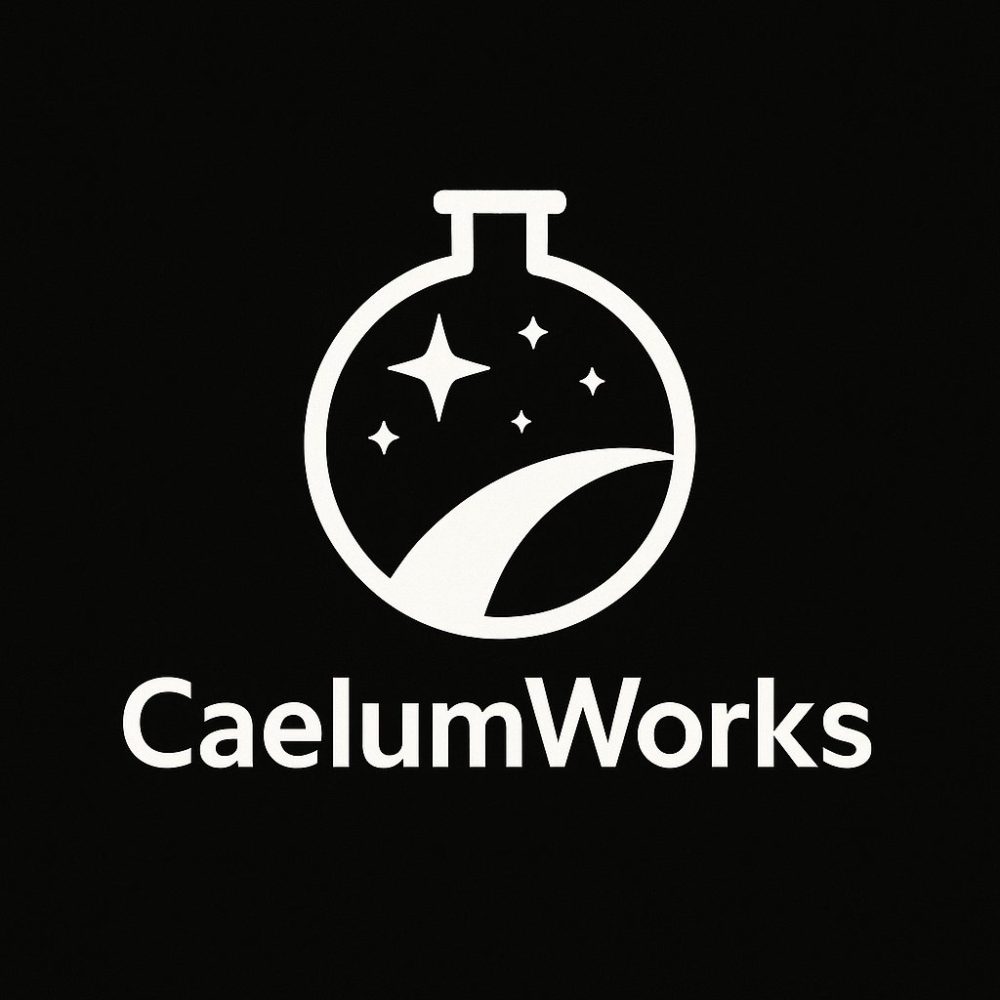

  

<h1 align="center">CaelumWorks</h1>

  A highly specialized technology company focused on delivering intelligent, scalable, and creative solutions powered by artificial intelligence.

  
  
  
  

---

## 🌟 About Us

At **CaelumWorks**, we build robust and complex systems designed for high availability and long-term maintainability, always following industry best practices and engineering excellence.

Our expertise spans real-time surveillance, predictive systems, and insight-driven applications — all crafted with a commitment to quality, reliability, and innovation.

---

## 🚀 Projects

### 🪐 [AstroNotify](https://github.com/CaelumWorks/AstroNotify)
A real-time astrology engine that tracks planetary transits and delivers personalized notifications.

- Built with Go and Python microservices
- Accurate ephemeris-based analysis
- Notification system for web/mobile integrations
- Spiritual insight meets software engineering

---

### 🛒 [SafeMarket](https://github.com/CaelumWorks/SafeMarket)
A monitoring and analytics platform for autonomous retail environments, with future integration of computer vision and AI.

- Real-time video ingestion
- Event-driven architecture
- Scalable and modular design
- Privacy-focused and observability-ready

---

## 💡 Our Principles

- **Engineering Excellence** – clean code, smart abstractions, robust design
- **AI-Driven Innovation** – practical use of intelligence and automation
- **Observability & Reliability** – systems built to run with clarity and uptime
- **Creative Vision** – from astrology to surveillance, we think outside the box

---

## 📫 Contact

We’re open to ideas, collaboration, and feedback.

- 📧 Email: [hello@caelum.works](mailto:hello@caelum.works)
- 🧑‍🚀 GitHub: [github.com/CaelumWorks](https://github.com/CaelumWorks)
- 🌐 Website: _Coming soon_

---

> _“Caelum” means sky in Latin. At CaelumWorks, we build what connects intelligence and vision — through code._
